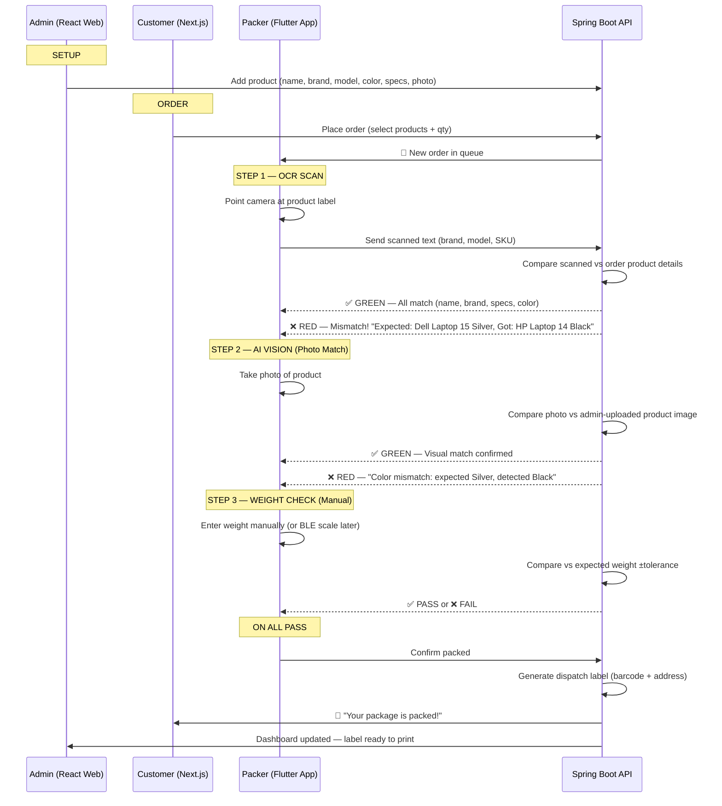
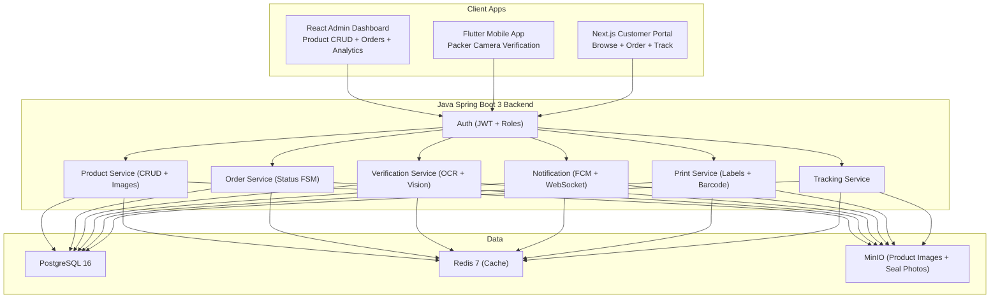

# SmartDispatch — Complete Implementation Plan (Updated)

## 1. Problem Statement

A logistics company dispatches wrong items frequently. Workers manually verify but errors happen during busy periods. **Solution**: Camera-based AI verification using smartphones (no special hardware initially).

**Key Decisions**:
- ✅ **Camera-only first** — OCR + AI Vision via smartphone camera (no RFID/NFC sled)
- ✅ **Customers order through our portal** — full e-commerce flow
- ✅ **Admin adds products with full specs** — brand, model, color, hardware specs, photos
- ✅ **Verification matches ALL details** — product name, brand, color, specs vs order
- ✅ **Mismatch = block + alert** — wrong product stops packing, notifies packer to fix

---

## 2. Core Verification Flow



### What Gets Compared (OCR + Vision)

| Field | Admin Enters | Camera Scans | Match Check |
|-------|-------------|-------------|-------------|
| Product Name | "Dell Inspiron 15" | OCR reads label text | Exact/fuzzy match |
| Brand | "Dell" | OCR reads brand name | Exact match |
| Model Number | "IN3520-7890" | OCR reads model # | Exact match |
| Color | "Silver" | AI Vision detects color | Color classification |
| Category | "Laptop" | AI Vision object type | Object detection |
| SKU | "SKU-DELL-3520-SLV" | OCR reads barcode/SKU | Exact match |
| Weight | "2.5 kg" | Manual entry or scale | ±tolerance |
| Photo | Admin uploads photo | Packer takes photo | AI similarity score |

### On Mismatch
- 🔴 Screen turns RED with vibration
- Shows: "WRONG PRODUCT" + what was expected vs what was scanned
- Packer CANNOT proceed — must scan correct product
- Alert sent to supervisor dashboard
- Logged for analytics (which products get mixed up most)

---

## 3. System Architecture



---

## 4. Technology Stack

| Layer | Tech | Purpose |
|-------|------|---------|
| Backend | Java 21 + Spring Boot 3 | REST API, auth, business logic |
| Mobile | Flutter 3 | Packer camera app (Android/iOS) |
| Admin Web | React 18 + Vite | Product management, dashboard |
| Customer Web | Next.js 14 | E-commerce, order tracking |
| Database | PostgreSQL 16 | Products, orders, users, logs |
| Cache | Redis 7 | Sessions, real-time counters |
| Storage | MinIO (S3) | Product photos, scan evidence |
| OCR | Google ML Kit (on-device) | Read labels offline |
| AI Vision | TensorFlow Lite (on-device) | Object + color detection |
| Notifications | Firebase FCM | Push to customer + packer |
| Print | PDF generation + barcode lib | Dispatch label with address |

**Phase 2 Add-ons** (later): RFID tags, NFC, BLE smart scale, GPS tracking

---

## 5. Database Schema

### users
| Column | Type | Notes |
|--------|------|-------|
| id | UUID PK | |
| name | VARCHAR | Full name |
| email | VARCHAR UNIQUE | Login |
| phone | VARCHAR | For SMS |
| password_hash | VARCHAR | BCrypt |
| role | ENUM | ADMIN, PACKER, CUSTOMER |
| worker_id | VARCHAR | WK-XXXXX (packers only) |
| pin_hash | VARCHAR | 6-digit PIN (packers) |
| active | BOOLEAN | Account status |
| created_at | TIMESTAMP | |

### products
| Column | Type | Notes |
|--------|------|-------|
| id | UUID PK | |
| sku | VARCHAR UNIQUE | SKU-DELL-3520-SLV |
| name | VARCHAR | "Dell Inspiron 15" |
| brand | VARCHAR | "Dell" |
| model_number | VARCHAR | "IN3520-7890" |
| category | VARCHAR | "Laptop" |
| color | VARCHAR | "Silver" |
| specs | JSONB | {"ram":"16GB","storage":"512GB SSD","screen":"15.6 FHD"} |
| weight_kg | FLOAT | 2.5 |
| weight_tolerance_g | INT | 100 (±grams) |
| price | DECIMAL | Product price |
| image_urls | TEXT[] | Array of image URLs from MinIO |
| description | TEXT | Full description |
| stock_qty | INT | Available stock |
| active | BOOLEAN | Listed in store |
| created_at | TIMESTAMP | |

### orders
| Column | Type | Notes |
|--------|------|-------|
| id | UUID PK | |
| order_number | VARCHAR | ORD-2024-8821 |
| customer_id | UUID FK | → users |
| packer_id | UUID FK | → users (assigned packer) |
| status | ENUM | PENDING, ASSIGNED, PACKING, VERIFIED, PACKED, SHIPPED, DELIVERED |
| total_amount | DECIMAL | |
| shipping_address | JSONB | {name, street, city, state, pin, phone} |
| tracking_number | VARCHAR | Generated on pack |
| label_url | VARCHAR | Dispatch label PDF URL |
| notes | TEXT | |
| created_at | TIMESTAMP | |
| packed_at | TIMESTAMP | |
| shipped_at | TIMESTAMP | |
| delivered_at | TIMESTAMP | |

### order_items
| Column | Type | Notes |
|--------|------|-------|
| id | UUID PK | |
| order_id | UUID FK | → orders |
| product_id | UUID FK | → products |
| quantity | INT | |
| ocr_verified | BOOLEAN | Step 1 pass |
| vision_verified | BOOLEAN | Step 2 pass |
| weight_verified | BOOLEAN | Step 3 pass |
| verified_at | TIMESTAMP | |

### verification_logs
| Column | Type | Notes |
|--------|------|-------|
| id | UUID PK | |
| order_id | UUID FK | |
| order_item_id | UUID FK | |
| worker_id | UUID FK | |
| step | ENUM | OCR, VISION, WEIGHT |
| result | ENUM | PASS, FAIL |
| scanned_data | JSONB | What OCR/Vision detected |
| expected_data | JSONB | What was expected |
| mismatch_fields | TEXT[] | ["color","model_number"] |
| photo_url | VARCHAR | Evidence photo |
| confidence | FLOAT | AI confidence score |
| created_at | TIMESTAMP | |

### notifications
| Column | Type | Notes |
|--------|------|-------|
| id | UUID PK | |
| user_id | UUID FK | |
| type | VARCHAR | ORDER_PLACED, PACKED, SHIPPED, etc |
| title | VARCHAR | |
| body | TEXT | |
| read | BOOLEAN | |
| created_at | TIMESTAMP | |

---

## 6. API Endpoints

### Auth
| Method | Route | Description |
|--------|-------|-------------|
| POST | /api/auth/register | Customer signup |
| POST | /api/auth/login | Email + password login |
| POST | /api/auth/pin-login | Worker PIN login |
| GET | /api/auth/me | Current user |

### Products (Admin)
| Method | Route | Description |
|--------|-------|-------------|
| GET | /api/products | List (with filters, pagination) |
| GET | /api/products/:id | Detail with all specs |
| POST | /api/products | Create with images upload |
| PUT | /api/products/:id | Update specs/images |
| DELETE | /api/products/:id | Soft delete |
| GET | /api/products/sku/:sku | Lookup by SKU (for OCR match) |

### Orders
| Method | Route | Description |
|--------|-------|-------------|
| POST | /api/orders | Customer places order |
| GET | /api/orders | List (role-filtered) |
| GET | /api/orders/:id | Full detail with items |
| PUT | /api/orders/:id/assign | Admin assigns packer |
| PUT | /api/orders/:id/status | Update status |
| GET | /api/orders/:id/label | Get/generate dispatch label PDF |

### Verification (Packer App)
| Method | Route | Description |
|--------|-------|-------------|
| POST | /api/verify/ocr | Submit scanned text → returns match result |
| POST | /api/verify/vision | Submit photo → returns AI comparison result |
| POST | /api/verify/weight | Submit weight → returns tolerance check |
| POST | /api/verify/complete | Mark order fully verified → trigger label + notification |

### Tracking
| Method | Route | Description |
|--------|-------|-------------|
| GET | /api/tracking/:orderNumber | Public tracking page data |
| WS | /ws/tracking/:orderId | WebSocket live updates |

---

## 7. Notification Flow

| Event | Who | Message |
|-------|-----|---------|
| Order placed | Admin + Packer | "New order ORD-8821 from Mrs. Priya" |
| OCR mismatch | Supervisor | "⚠ Wrong product scanned for ORD-8821" |
| Vision mismatch | Supervisor | "⚠ Color mismatch on ORD-8821" |
| All verified | Customer | "✅ Your order is packed and ready!" |
| Label printed | Packer | "Label for ORD-8821 ready" |
| Shipped | Customer | "📦 Your order is on the way!" |
| Delivered | Customer | "✅ Order delivered!" |

---

## 8. Project Structure

```
smartdispatch/
├── backend/                    # Java Spring Boot 3
│   ├── src/main/java/com/smartdispatch/
│   │   ├── auth/               # JWT + roles
│   │   ├── product/            # CRUD + image upload
│   │   ├── order/              # Order + status FSM
│   │   ├── verification/       # OCR/Vision/Weight match logic
│   │   ├── notification/       # FCM push
│   │   ├── print/              # Label PDF + barcode
│   │   ├── tracking/           # Order tracking
│   │   └── config/             # Security, CORS, S3
│   └── pom.xml
├── mobile/                     # Flutter 3
│   ├── lib/
│   │   ├── core/theme/         # Dark design system
│   │   ├── auth/               # Login
│   │   ├── dashboard/          # Packer home
│   │   ├── scanner/            # OCR camera
│   │   ├── vision/             # AI photo check
│   │   ├── weight/             # Weight entry
│   │   └── shared/             # Widgets, API service
│   └── pubspec.yaml
├── admin-dashboard/            # React + Vite
│   ├── src/
│   │   ├── pages/              # Products, Orders, Workers, Dashboard
│   │   ├── components/         # Tables, Forms, Charts, PrintPreview
│   │   └── services/           # API, WebSocket, Auth
│   └── package.json
├── customer-portal/            # Next.js 14
│   ├── app/
│   │   ├── products/           # Browse catalog
│   │   ├── cart/               # Shopping cart
│   │   ├── orders/             # Order history
│   │   ├── tracking/           # Live tracking
│   │   └── auth/               # Login/signup
│   └── package.json
└── infra/
    └── docker-compose.yml      # PostgreSQL, Redis, MinIO
```

---

## 9. Development Roadmap

### Phase 1 — Foundation (Weeks 1-3)
- [ ] Spring Boot + PostgreSQL + Redis + MinIO Docker setup
- [ ] Auth system (JWT, 3 roles)
- [ ] Product CRUD API with image upload
- [ ] Order placement + status FSM API
- [ ] React Admin: Product management (add with all specs + photos)
- [ ] Next.js Customer: Browse + cart + place order
- [ ] Notification API (FCM setup)

### Phase 2 — Packer App + Verification (Weeks 4-6)
- [ ] Flutter dark theme design system
- [ ] Login screen (PIN + biometric)
- [ ] Packer dashboard (order queue)
- [ ] OCR camera scan (ML Kit → compare product details)
- [ ] AI Vision photo check (TFLite → compare product + color)
- [ ] Weight entry (manual first, BLE scale later)
- [ ] Verification result screens (GREEN pass / RED fail)
- [ ] Mismatch blocking + supervisor override

### Phase 3 — Labels + Tracking (Weeks 7-9)
- [ ] Dispatch label generation (barcode + address PDF)
- [ ] Admin print center
- [ ] Customer tracking page (real-time status)
- [ ] Push notifications at each stage
- [ ] Analytics dashboard (error rates, throughput)
- [ ] Order history for customers

### Phase 4 — Hardware Add-ons (Weeks 10+, optional)
- [ ] RFID tag write + gate scan
- [ ] NFC tap confirmation
- [ ] BLE smart scale integration
- [ ] GPS truck tracking
- [ ] Delivery OTP verification

---

## 10. Open Questions

> [!IMPORTANT]
> **1.** What product categories will you handle? (Electronics, groceries, clothing, all?) This affects the AI model training.

> [!IMPORTANT]  
> **2.** Self-hosted server or cloud (AWS/GCP)? Affects deployment setup.

> [!NOTE]
> **3.** Ready to start Phase 1 after your approval. The Flutter and React UI/UX specs are in separate documents.
