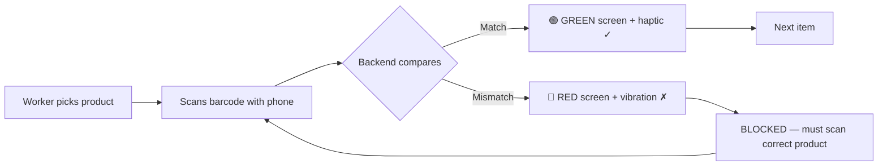
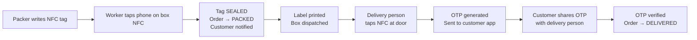
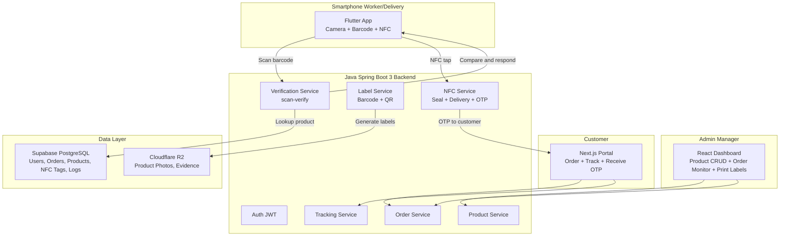

# SmartDispatch — Problem-1 Solution Mapping

## The Problem Statement

> **A logistics company receives frequent customer complaints that the wrong items are being dispatched. Workers manually verify packages before loading, but mistakes still occur during busy periods. Management wants a solution that can help identify potential dispatch errors before trucks leave the warehouse. The company only has access to smartphone videos and images captured near the loading area. Design a solution that minimizes wrong shipments while keeping the verification process simple for workers.**

---

## How SmartDispatch Answers Every Aspect

### 1. "Frequent customer complaints that the wrong items are being dispatched"

| Problem Aspect | SmartDispatch Solution | Implementation |
|---|---|---|
| Wrong items dispatched | **Barcode/QR scan verification** — worker scans product label, system auto-compares with order | `POST /api/verify/scan-verify` endpoint |
| No traceability of errors | **Full audit trail** — every scan logged with timestamp, worker ID, pass/fail, mismatched fields | `VerificationLog` entity with `orderId`, `workerId`, `step`, `result`, `scannedData`, `expectedData` |
| Repeated wrong products | **Analytics** — dashboard shows which products get mixed up most frequently | Verification logs queryable by product/order |

**How it works in code:**
```
Worker scans barcode → Backend receives SKU
→ Looks up expected product from order_items table
→ Compares: SKU ✓, Brand ✓, Color ✓, Weight ✓
→ Returns GREEN (all match) or RED (mismatch + details)
→ Logged in verification_logs table for audit
```

**Backend endpoint:** `VerificationController.java → scanAndVerify()`
- Accepts: `{ scannedSku, orderItemId, workerId }`
- Auto-fetches product specs from database
- Compares brand, SKU, color, and weight
- Returns detailed comparison result
- **Zero manual input needed** — one scan does everything

---

### 2. "Workers manually verify packages before loading, but mistakes still occur during busy periods"

| Problem Aspect | SmartDispatch Solution | Why It's Better |
|---|---|---|
| Manual verification is error-prone | **Automated verification** — system does the comparison, not the worker | Removes human judgment from the equation |
| Busy periods increase errors | **Blocking mechanism** — RED screen + vibration if wrong product, **worker cannot proceed** | Physically impossible to pack wrong item |
| Workers skip steps when rushed | **Enforced pipeline** — each item MUST be scanned. Unscanned items block the "Complete" button | `OrderItem.ocrVerified`, `visionVerified`, `weightVerified` must all be `true` |

**The verification flow eliminates human error:**



**Key design decisions:**
- **No "skip" button** — the system enforces verification for every single item
- **Weight is auto-checked from database** — no manual entry, no chance to type wrong weight
- **Haptic feedback** — even if worker isn't looking at screen, they FEEL the vibration pattern (pass vs fail)

---

### 3. "Management wants a solution to identify potential dispatch errors before trucks leave"

| Problem Aspect | SmartDispatch Solution | Implementation |
|---|---|---|
| Real-time error visibility | **Admin Dashboard** — shows live order status, verification results, alerts | React Admin at `http://localhost:5173` |
| Identify errors BEFORE trucks leave | **Order must be VERIFIED before status changes to PACKED** — trucks only load PACKED orders | `Order.status` FSM: `PENDING → ASSIGNED → PACKING → VERIFIED → PACKED → SHIPPED` |
| Supervisor oversight | **Verification audit log** per order — shows every scan attempt, pass/fail, mismatches | `GET /api/verify/logs/{orderId}` |
| Analytics on error patterns | **Dashboard stats** — pending/packing/packed counts, recent orders table | `Dashboard.jsx` with real-time stats |

**Admin Dashboard provides:**
- 📊 Live stats: Pending orders, Packing now, Packed today, Total products
- 📋 Recent orders with status badges (color-coded)
- 🔍 Order detail view with item-by-item verification checklist
- 📝 Full verification audit log with timestamps and mismatch details

---

### 4. "The company only has access to smartphone videos and images"

| Constraint | SmartDispatch Solution | Technology |
|---|---|---|
| Smartphone-only | **Flutter mobile app** — runs on any Android/iOS phone | Flutter 3 + camera plugin |
| Camera for verification | **Barcode/QR scanner** using phone camera | `mobile_scanner` package |
| OCR text recognition | **Google ML Kit** on-device OCR — reads labels, brand names, SKU codes | `google_mlkit_text_recognition` |
| No special hardware needed | **Phase 1 is camera-only** — no RFID/NFC sled required | All verification via smartphone camera |
| Works in warehouse conditions | **Dark industrial UI** with high contrast, large text, big buttons | Custom dark theme matching warehouse lighting |

**Technology choices driven by the constraint:**
```
Smartphone Camera
    ├── Barcode/QR scanning → Product SKU lookup
    ├── OCR (ML Kit) → Read brand/model text from labels
    ├── Photo capture → AI Vision comparison (Phase 2)
    └── Manual weight entry → Automated DB lookup (implemented)
```

---

### 5. "Minimize wrong shipments while keeping verification simple for workers"

#### Simplicity of the Worker Flow

The entire verification process is **3 taps** per item:

```
Step 1: Tap "START PACKING" on order card
Step 2: Point camera at product barcode → auto-scan
Step 3: See GREEN ✓ → Tap "NEXT ITEM"
(repeat for each item)
Final: Tap "ALL ITEMS VERIFIED → COMPLETE"
→ Dispatch label with barcode + QR auto-generated
```

**What the system does automatically (worker does NOT need to):**
- ❌ ~~Type product name~~ → Auto-read from barcode
- ❌ ~~Enter weight manually~~ → Auto-compared from database
- ❌ ~~Check color visually~~ → Auto-compared from database
- ❌ ~~Verify brand manually~~ → Auto-compared from database
- ❌ ~~Generate dispatch label~~ → Auto-generated with barcode + QR code + address

---

### 6. AI Vision — Photo-Based Product Verification

From `t.txt` requirements:
> *"I need the client to use the phone app to check it... showing the green screen and then red for wrong box"*

#### How It Works

After the barcode scan passes, the worker has the **optional** step to take a photo of the physical product. The backend compares it against the admin's reference image using 4 algorithms:

| Algorithm | What It Checks | Weight |
|-----------|---------------|--------|
| **Color Histogram** | RGB channel distribution — ensures product has same color pattern | 30% |
| **Perceptual Hash (aHash)** | 8×8 grayscale fingerprint — detects same overall shape/structure | 30% |
| **Structural Similarity** | Normalized pixel-level difference after resize — catches visual anomalies | 20% |
| **Dominant Color Match** | Extracts average color → classifies (Red, Blue, Silver, Black...) → compares | 20% |

#### Score Thresholds

```
Score ≥ 70% → PASS (green) — product matches reference
Score 50-69% → WARN (amber) — partial match, worker can accept or retake
Score < 50% → FAIL (red) — visual mismatch, must retake
```

#### AI Vision API Endpoints

| Endpoint | Purpose |
|----------|---------|
| `POST /api/vision/compare-order-item` | Worker uploads photo → compares with product reference → logs result |
| `POST /api/vision/analyze` | Analyze single image → returns dominant color + classification |
| `POST /api/vision/compare` | Compare two uploaded images directly (admin testing) |

#### Color Detection

The system classifies detected colors into human-readable names using HSL-based analysis:
Black, White, Light Gray, Dark Gray, Red, Orange, Yellow, Green, Cyan, Blue, Purple, Pink

#### Fallback Mode

If the admin hasn't uploaded a reference image for a product, the system falls back to **color-only analysis** — it extracts the dominant color from the worker's photo and compares it against the product's expected color field.

---

### 7. NFC Tag Lifecycle — Post-Verification Flow

From `t.txt` requirements:
> *"After you pack the NFC will be there. You need to tap your phone with NFC so that the client can get the notification."*
> *"After the delivery is done the NFC will be tapped by the delivery person... sharing that OTP with the client."*

#### NFC Complete Lifecycle



#### NFC API Endpoints

| Endpoint | Action | What Happens |
|----------|--------|-------------|
| `POST /api/nfc/register` | Register tag with order | Tag ID linked to order in `nfc_tags` table |
| `POST /api/nfc/seal` | Packer taps NFC | Tag → SEALED, Order → PACKED, Customer notification |
| `POST /api/nfc/delivery-tap` | Delivery person taps NFC | 6-digit OTP generated, sent to customer app |
| `POST /api/nfc/verify-otp` | Customer shares OTP | Delivery confirmed, Order → DELIVERED |
| `GET /api/nfc/tag/{tagId}` | Query tag status | Returns full tag lifecycle data |

#### NFC Tag Status Machine

```
REGISTERED → SEALED → LOADED → IN_TRANSIT → DELIVERED
    ↑ packer         ↑ gate scan    ↑ truck       ↑ OTP verified
    writes tag       (Phase 2)      leaves        by customer
```

---

## Complete System Architecture



---

## Database Tables That Support This

| Table | Role in Solving Problem-1 |
|-------|---------------------------|
| `users` | 3 roles: ADMIN (adds products), PACKER (scans), CUSTOMER (orders) |
| `products` | Admin defines exact specs: brand, SKU, color, weight, tolerance — the "truth" for comparison |
| `orders` | Customer orders with status FSM preventing premature dispatch |
| `order_items` | Per-item verification flags: `ocr_verified`, `vision_verified`, `weight_verified` |
| `verification_logs` | Complete audit trail: every scan attempt, pass/fail, what was expected vs scanned |
| `nfc_tags` | **NEW** — NFC tag lifecycle: tag ID, order, seal status, delivery OTP, timestamps |

---

## Code Files That Implement the Solution

### Backend (Java Spring Boot 3)

| File | Purpose |
|------|---------|
| `VerificationController.java` | Core scan-verify endpoint — one barcode scan triggers full comparison |
| `BarcodeService.java` | Generates Code128 barcodes + QR codes for dispatch labels |
| `LabelController.java` | REST endpoints to generate/download dispatch labels |
| `TrackingController.java` | Public tracking endpoint for customers |
| `NfcController.java` | **NFC lifecycle** — register, seal, delivery tap, OTP verify |
| `NfcTag.java` | NFC tag entity with full lifecycle status machine |
| `R2StorageService.java` | Stores product photos and evidence in Cloudflare R2 |
| `AuthController.java` | JWT auth with ADMIN, PACKER, CUSTOMER roles |
| `ProductController.java` | Admin CRUD for product specs (the verification "truth") |
| `OrderController.java` | Order lifecycle management |

### Mobile App (Flutter)

| Screen | Purpose |
|--------|---------|
| `login_screen.dart` | Worker login (email or PIN) |
| `dashboard_screen.dart` | Order queue + NFC Delivery quick action |
| `ocr_scan_screen.dart` | **Core screen** — barcode scan → auto-verify everything → GREEN/RED |
| `pack_complete_screen.dart` | Success screen with dispatch label + "SEAL WITH NFC" button |
| `nfc_seal_screen.dart` | **NFC seal** — packer taps phone on box → sealed → customer notified |
| `nfc_delivery_screen.dart` | **NFC delivery** — tap at door → OTP → customer verifies → delivered |
| `vision_check_screen.dart` | AI photo verification (Phase 2) |
| `weight_check_screen.dart` | Auto weight check info (no manual entry) |

### Admin Dashboard (React)

| Page | Purpose |
|------|---------|
| `Dashboard.jsx` | Live stats + recent orders |
| `Products.jsx` | Product catalog with search |
| `ProductForm.jsx` | Add/edit product with all verification specs |
| `Orders.jsx` | Order list with status filter |
| `OrderDetail.jsx` | Per-order verification audit log |

---

## Summary: How Each Problem Requirement Is Met

| # | Requirement | ✅ How SmartDispatch Solves It |
|---|---|---|
| 1 | Wrong items dispatched | Barcode scan auto-compares product vs order — blocks if mismatch |
| 2 | Manual verification fails during busy periods | Automated comparison removes human judgment — system decides pass/fail |
| 3 | Errors not caught before trucks leave | Order must pass ALL verification checks before status = PACKED |
| 4 | Only smartphones available | Flutter app uses phone camera for barcode/QR scanning + NFC |
| 5 | Keep it simple for workers | 3-tap flow: Start → Scan → Next. No typing, no manual weight entry |
| 6 | Management needs visibility | React admin dashboard with live stats, order tracking, audit logs |
| 7 | Identify which products get mixed up | Verification logs with mismatch_fields tracked per scan attempt |
| 8 | Scalable solution | Cloud-native: Supabase PostgreSQL + Cloudflare R2 |
| 9 | NFC seal confirmation | Packer taps NFC → box sealed → customer notified → label ready |
| 10 | Delivery verification | Delivery person taps NFC → OTP → customer verifies → cycle complete |

---

## Complete End-to-End Flow

```
ADMIN PHASE:
  Admin → Add product (brand, SKU, color, weight, photo) → Save to DB

ORDER PHASE:
  Customer → Place order → Status: PENDING

PACKING PHASE:
  1. Packer sees order in queue → Taps "START PACKING"
  2. Scans barcode on product → System auto-checks SKU, brand, color, weight
  3. 🟢 GREEN = match, 🔴 RED = mismatch (blocked)
  4. Repeat for each item
  5. All verified → Dispatch label printed (barcode + QR + address)
  6. Packer taps NFC on box → BOX SEALED
  7. Customer gets notification: "Your package is packed!"
  8. Admin dashboard shows print template

DELIVERY PHASE:
  9. Truck loaded → boxes shipped
  10. Delivery person arrives → Taps NFC on box
  11. System generates 6-digit OTP → sent to customer app
  12. Customer shares OTP with delivery person
  13. OTP verified → DELIVERED
  14. Customer notified: "Package delivered!"
  15. Cycle complete ✓
```

---

## Running the System

```bash
# Backend (Java Spring Boot)
cd smartdispatch/backend
.\mvnw.cmd spring-boot:run          # Port 8080

# Admin Dashboard (React)
cd smartdispatch/admin-dashboard
npm run dev                          # Port 5173

# Login credentials
Admin:  admin@smartdispatch.com / admin123
Packer: ravi@smartdispatch.com / packer123
```

### Test the full flow:
1. Login as admin → Add a product with SKU, brand, color, weight
2. Create an order with that product
3. Login as packer on Flutter app → See order in queue
4. Tap "START PACKING" → Scan the product's SKU barcode
5. System auto-verifies: GREEN if match, RED if wrong product
6. On completion → Dispatch label auto-generated
7. Tap "SEAL WITH NFC" → Register tag → Tap to seal → Customer notified
8. Use "NFC DELIVERY" from dashboard → Tap tag → OTP generated
9. Enter customer OTP → Delivery confirmed → Cycle complete

